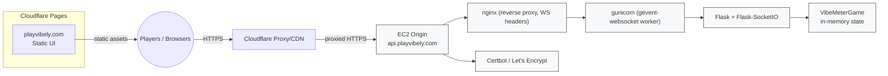
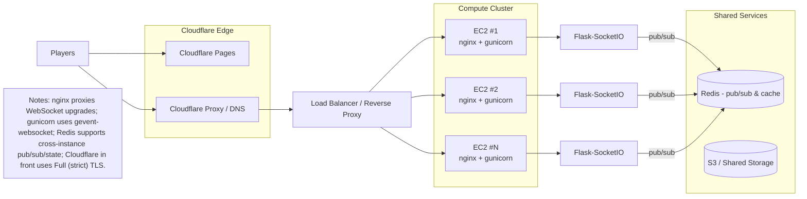

# 🎛️ Vibely
## Architecture Diagrams (Mermaid)

Below are two diagrams in Mermaid syntax: the first shows the current production flow, the second shows an expanded, horizontally scalable option with Redis and a load balancer.

1) High-level production flow



2) Expanded deployment option (horizontal scale + Redis)



Notes:
- These diagrams represent logical components and relationships. For a one-node deployment (the current production), the EC2 instance runs `nginx`, `gunicorn` (gevent), `Flask-SocketIO`, and in-memory game state. For scale-out, add multiple EC2 instances behind a load balancer and use Redis for shared state/pub-sub.
```bash
python3 -m venv .venv
source .venv/bin/activate
pip install -r requirements.txt
python app.py        # starts server on http://localhost:3000
```

If you want remote players during development, you can temporarily use a tunnel (Cloudflare Tunnel or ngrok). Do not use tunnels as a long-term production solution.

---

## Quick Production Checklist (what we did)

1. Deployed `public/` to Cloudflare Pages and pointed `playvibely.com` / `www.playvibely.com` there.
2. Launched an Ubuntu EC2 instance and attached an Elastic IP for `api.playvely.com`.
3. Installed Python, created a virtualenv, installed `requirements.txt`, and installed `gunicorn`, `gevent`, `gevent-websocket`.
4. Created a `systemd` service to run `gunicorn` and keep the app alive.
5. Configured `nginx` as a reverse proxy with websocket headers and allowed `80/443` traffic.
6. Issued a Let's Encrypt certificate with `certbot --nginx -d api.playvibely.com` and enabled HTTPS.
7. Pointed Cloudflare DNS `api` A record at the EC2 Elastic IP and enabled Cloudflare proxy (orange cloud) with SSL mode `Full (strict)`.

---

## Architecture (brief)

The backend is a single-process in-memory game server that holds per-room `VibeMeterGame` instances keyed by 4-letter codes. Socket.IO events mutate game state and the server broadcasts per-socket personalized snapshots.

Key constraints:

- In-memory state means server restarts will drop active games; consider Redis for shared state if you need failover.
- No persistent authentication — names are ephemeral and enforced only for duplicates per-room.

---

## Security notes (summary)

- Requests are served with a restrictive Content Security Policy and other headers applied in `app.py` via `@app.after_request`.
- `CORS_ALLOWED_ORIGINS` is enforced for Socket.IO and should be set to your production hostnames only.
- Rate-limiting and lightweight per-socket throttling are used to mitigate event flooding.

---

If you want, I can add a short `deploy/` folder with the `nginx` site file, the `systemd` unit, and a `.env.example` to make future redeployments reproducible.

| 2 | `cloudflared tunnel --url localhost:3000` | Expose publicly via Cloudflare Tunnel |

**Stack:** Python · Flask · Flask-SocketIO · gevent (WebSockets)

---

## Planned Deployment (Free-First)

This is the deployment plan for launching on `playvibely.com` while keeping costs near zero initially.

### Goals

- Keep startup cost minimal.
- Avoid opening router ports at home.
- Keep local bandwidth usage manageable.
- Add monitoring and automatic recovery.

### Phase 1: Free Baseline (Recommended to Start)

1. Host static frontend files (`public/`) on **Cloudflare Pages** (free tier).
2. Run backend (`app.py`) on your home PC.
3. Expose backend through **Cloudflare Tunnel** to `api.playvibely.com`.
4. Monitor availability with **UptimeRobot** (free tier, 5-minute checks).
5. Auto-start backend and tunnel at boot with **Windows Task Scheduler**.

This keeps the high-bandwidth static traffic on Cloudflare and sends only real-time game traffic to your home server.

### DNS / Domain Layout

- `playvibely.com` -> Cloudflare Pages (frontend)
- `www.playvibely.com` -> redirect to `playvibely.com` (optional)
- `api.playvibely.com` -> Cloudflare Tunnel -> `http://localhost:3000`

### Backend Production Notes

- Run with `FLASK_ENV=production`.
- Set `CORS_ALLOWED_ORIGINS` to your real domains:
        - `https://playvibely.com`
        - `https://www.playvibely.com`
- Keep service bound to localhost behind tunnel.
- Add a health endpoint (`GET /health`) returning HTTP 200 JSON.

### Uptime Monitoring

- Create an HTTPS monitor for `https://api.playvibely.com/health`.
- Enable alert contacts (email/Discord/webhook).
- Treat this as outage detection, not outage prevention.

### Reliability Reality Check

Home hosting cannot guarantee 100% uptime due to power, ISP, and hardware risks. This plan is a practical low-cost baseline, not true high availability.

### Phase 2: Cheap Reliability Upgrade

When traffic grows or uptime needs improve:

1. Add a low-cost VPS as warm backup backend.
2. Move shared room/session state to Redis so failover preserves game continuity.
3. Add automatic failover routing (for example, Cloudflare Load Balancer).

---

## Architecture

The backend is a **single-process Python monolith** supporting multiple concurrent rooms:

```
Browser (Socket.IO client)
        |
        │  WebSocket  (connects with ?room=CODE)
        ▼
  Python / Flask + Flask-SocketIO (gevent)
  ┌──────────────────────────────────────────────────┐
  │  rooms: dict[str, VibeMeterGame]                 │
  │    ABCD → VibeMeterGame  (phases & scoring)      │
  │    XYZW → VibeMeterGame                          │
  │    …                                             │
  │  Socket event handlers                           │
  └──────────────────────────────────────────────────┘
```

Game state lives in per-room `VibeMeterGame` instances stored in a `rooms` dict keyed by 4-character room codes. Every Socket.IO event mutates the relevant instance and calls `broadcast(code)`, which rebuilds a personalised state snapshot for each connected socket and pushes it simultaneously.

This is intentionally minimal — no database, no authentication, no persistence between sessions.

### Class Hierarchy

```
Player  (base — name, sid, score, is_host)
├── ActivePlayer    — has vibe-man rotation slot, guess state, phrase history
└── SpectatorPlayer — observer; submits a phrase to the pending queue;
                      promoted to ActivePlayer at the start of the next round
```

### Server State Machine

```
lobby ──► phrase-input ──► playing ──► game-over
                               │
                           roundPhase:                                 
         phrase-select ──► vibe-writing ──► guessing ──► round-results
              ▲                                           │
              └──────────── (next round) ─────────────────┘
                           (loops until points goal reached)
```

### Multi-Room Layout

```
rooms: dict[str, VibeMeterGame]
  ABCD → VibeMeterGame   (players, phase, round state …)
  XYZW → VibeMeterGame
  …

sid_to_room: dict[str, str]   ← reverse index for O(1) disconnect lookup
```

`GET /` serves a home screen where users can create a room or enter a 4-letter code. Room URLs use `/<CODE>` (e.g. `/ABCD`). Subsequent visitors to the same URL join the existing room.

### Broadcast / State Flow

```
Socket.IO event received
        │
        ▼
event handler  →  mutates VibeMeterGame
        │
        ▼
broadcast(code)
        │  for each sid in room:
        ▼
build_state(sid)          ← personalises snapshot (isVibeman, hasSubmittedGuess, …)
        │
        ▼
emit('state', snapshot)   → browser
```

## Security

This section documents the security findings identified during review and how each was addressed.

### Findings & Mitigations

| # | Finding | Severity | Status |
|---|---------|----------|--------|
| 1 | Missing Content-Security-Policy header | Medium | Fixed |
| 2 | Unbounded room creation (memory DoS) | Medium | Fixed |
| 3 | XSS via user-controlled strings | High | Pre-existing mitigation |
| 4 | Path traversal via `/<path>` route | High | Pre-existing mitigation |
| 5 | Cross-origin WebSocket access | Medium | Pre-existing mitigation |
| 6 | Event flooding / socket abuse | Low–Medium | Pre-existing mitigation |

#### 1 — Missing Content-Security-Policy (Fixed)
**Issue:** No `Content-Security-Policy` header was set, so a browser would apply no restrictions on where scripts, styles, and connections could be loaded from — weakening XSS defenses.  
**Fix:** Added a CSP in `set_security_headers()` restricting scripts to `'self'`, fonts to Google Fonts, WebSocket connections to the serving origin, and blocking all plugin execution (`object-src 'none'`). `style-src` includes `'unsafe-inline'` because the UI uses element-level inline styles extensively. `frame-ancestors 'none'` supersedes the existing `X-Frame-Options: DENY` for modern browsers.

#### 2 — Unbounded Room Creation / Memory DoS (Fixed)
**Issue:** Any connected socket could fire `create-room` at arbitrary frequency. Because newly created rooms are not tracked in `sid_to_room` (they are only populated when a socket joins via `connect`), the periodic 10-minute cleanup would not catch orphaned rooms created and abandoned this way. A single client could therefore exhaust server memory.  
**Fix:** Two controls added:
- `create-room` is added to the per-sid rate-limit table with a **5-second minimum gap**, enforced by the existing `_allow_event()` mechanism.
- A `_MAX_ROOMS = 500` hard cap rejects new room creation when the server already holds 500 rooms.

#### 3 — XSS via User-Controlled Strings (Pre-existing mitigation)
**Issue (potential):** Player names, phrase labels, and stories are entered by users and later rendered into the DOM via `innerHTML` template literals.  
**Mitigation already in place:** All user-supplied strings are passed through `esc()` (`utils.js`) before HTML interpolation. `esc()` replaces `&`, `<`, `>`, `"`, and `'` with their HTML entities. Server-side, inputs are also stripped and length-capped before storage.

#### 4 — Path Traversal via `/<path>` Route (Pre-existing mitigation)
**Issue (potential):** The catch-all route `/<path:path>` serves static files from `public/`. A crafted path like `../../app.py` could escape the `public/` directory.  
**Mitigation already in place:** `os.path.realpath()` is used to resolve both the public root and the requested path, and the handler verifies the resolved path starts with `public_root + os.sep` before serving.

#### 5 — Cross-Origin WebSocket Access (Pre-existing mitigation)
**Issue (potential):** Without CORS restrictions, any website could open a WebSocket to the server and join or control game rooms.  
**Mitigation already in place:** `flask-socketio` is initialised with `cors_allowed_origins` set to the list in the `CORS_ALLOWED_ORIGINS` environment variable, defaulting to `[]` (same-origin only). To permit remote players through a tunnel, set this variable explicitly.

#### 6 — Event Flooding / Socket Abuse (Pre-existing mitigation)
**Issue (potential):** High-frequency Socket.IO events (`live-pos`, `suggest-phrase`, `vote-suggested-phrase`) could be used to spam the server or other clients.  
**Mitigation already in place:** `_allow_event()` enforces a per-socket minimum time gap for those events. The pending phrase suggestion queue is also hard-capped at 30 items.

---